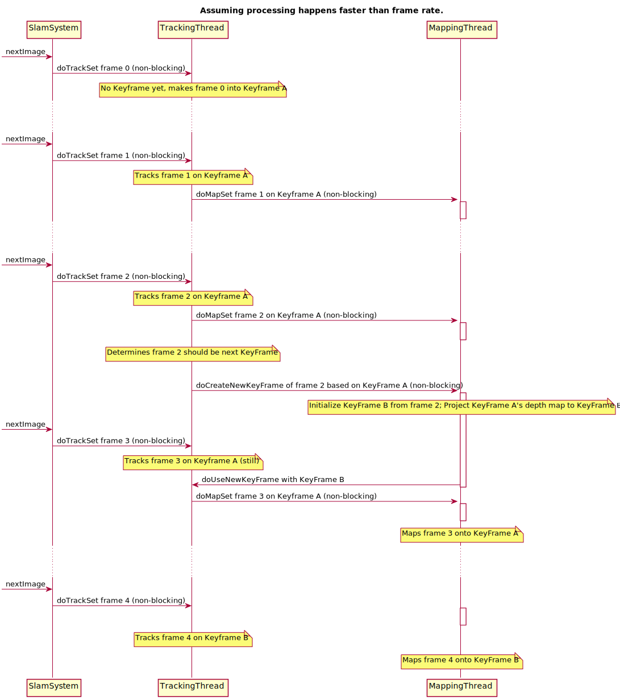

Architecture and Process Flow
=============================

The topmost object in LSD-SLAM is :class:`lsd_slam::SlamSystem`.  It is the
primary container of both system state and the sub-threads which do the work.
Once created, the main access point is :func:`lsd_slam::SlamSystem::nextImage`
(for mono) and :func:`lsd_slam::SlamSystem::nextImageSet` (for stereo)
which are used to provide the next image to the algorithm.

Data structures
---------------

The main data structures are:

:class:`lsd_slam::Frame`
  is a single image from the incoming data stream.  It contains pre-computed
  values (an image pyramid, gradient images, etc.) used when
  processing that image.   Frames are generally not retained long-term, unless an
  image is converted to a KeyFrame

:class:`lsd_slam::KeyFrame`
  represents a single key frame.  It contains the original Frame, along with
  supplemental data structures used to perform KeyFrame-specific functions:
  a DepthMap for the associated point cloud, and a TrackingReference for
  accelerating subsequent tracking operations against the Key Frame.

:class:`lsd_slam::DepthMap`
  contains the data and code for performing KeyFrame point cloud updates
  (variable-baseline stereo).

:class:`lsd_slam::KeyFrameGraph`
  stores all KeyFrames both as a simple list and as an undirected pose graph constrained by
  the estimated odometry between poses.

Threads
-------

LSD-SLAM has four top-level threads.  The thread objects are designed as
execution contexts first, although they also store the subset of the
"global" state which is most relevant to their mission.

:class:`lsd_slam::TrackingThread`
  is responsible for calculating the pose of the current image relative to the
  current Keyframe.

:class:`lsd_slam::MappingThread`
  takes tracked frames and uses them to update the depth map estimate for the
  current KeyFrame.

:class:`lsd_slam::ConstraintSearchThread`
  operates in spare cycles to search for additional cross-links between
  KeyFrames based on appearance.

:class:`lsd_slam::OptimizationThread`
  operates in spare cycles to globally optimize the pose graph.

Active objects
--------------

Each thread object is implemented as an
`ActiveObject <https://github.com/apl-ocean-engineering/libactiveobject>`_,
a work queue model where member calls to the object are executed
asynchronously in a separate thread of execution.   As a convention, the methods
for those calls start with "do" and the actual implementations end with "Impl".
So for example, calling :func:`lsd_slam::MappingThread::doMapSet` causes a call to
:func:`lsd_slam::MappingThread::mapSetImpl` to be queued for execution within
the MappingThread.

Tracking / Mapping core
-----------------------

The inner core of the algorithm consists of the interaction between the
Tracking and Mapping threads.  This is illustrated in the diagram below, which
assumes the computer is fast enough to track / map at faster than frame rate.

The application feeds images to LSD-SLAM via
:func:`lsd_slam::SlamSystem::nextImage` or
:func:`lsd_slam::SlamSystem::nextImageSet`.   Internally, LSD-SLAM works with :class:`lsd_slam::ImageSet`
as a container of one or more :class:`lsd_slam::Frame`.   This allows, for example, stero pairs of images to be
passed in together.  :func:`lsd_slam::SlamSystem::nextImage` is a convenience function which allows
passing a single image in.

SlamSystem then passes the ImageSet to TrackingThread via
:func:`lsd_slam::TrackingThread::doTrackSet`.
TrackingThread calculates the pose of that new image relative to the current
KeyFrame.

When TrackingThread is done, it passes the ImageSet and KeyFrame to
MappingThread via :func:`lsd_slam::MappingThread::doMapSet`
where the images in the set are used to update the DepthMap for the KeyFrame.

The decision to make a new KeyFrame is made in TrackingFrame based on the pose
distance from the KeyFrame as well as statistics about the number of frames
tracked on the current KeyFrame.    The  transition to the new KeyFrame,
however, is handled in MappingThread in
:func:`lsd_slam::MappingThread::doCreateNewKeyFrame`.
This function initializes the depth map of the new KeyFrame by re-projecting the
data for the prior KeyFrame.   It signals completion by sending
:func:`lsd_slam::TrackingThrea::doUseNewKeyFrame`   In this way,
TrackingThread will continue to track incoming frames against the *previous*
KeyFrame until the new KeyFrame is ready.   The message queue architecture
synchronizes the transition between KeyFrames without locking, although
a flag is used to ensure TrackingThread only nominates one new KeyFrame.

Blocking / non-realtime mode
----------------------------

If :func:`lsd_slam::Configuration::runRealTime` is ``false``, the systems runs as a
single thread, and all of the ActiveObject calls listed above become blocking.  So,
for example, a call to :func:`lsd_slam::SlamSystem::nextImageSet` will make a
blocking call to :func:`lsd_slam::TrackingThread::doTrackSet` which will make a blocking call to
:func:`lsd_slam::MappingThread::doMapSet`, etc.  Control will not return from :func:`lsd_slam::SlamSystem::nextImageSet`
until both tracking and mapipng have finished.  This allows lock-step operation over
pre-recorded movies or set of images.
